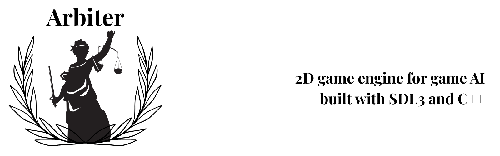

## Overview
**Arbiter** is a 2D game engine focused on game AI. Arbiter can be used to create NPCs using **state machines**, **behavior trees*, *utility AI*, **GOAP* and more.

## Code Style
Arbiter follows the **[Google C++ Style Guide](https://google.github.io/styleguide/cppguide.html)** to maintain a consistent, readable, and maintainable codebase.

